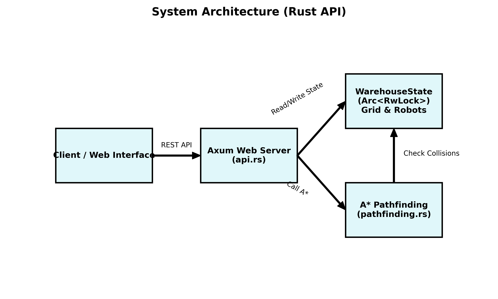
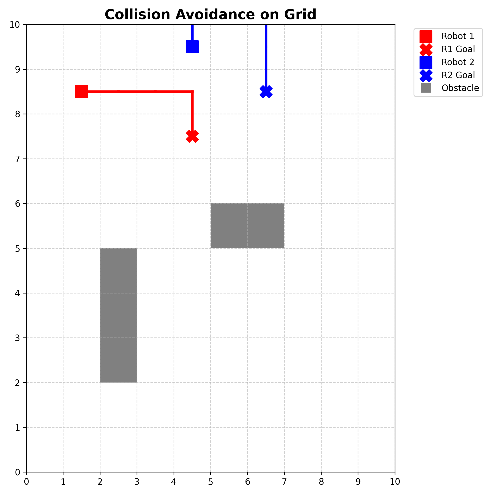

# Warehouse AGV Fleet Coordinator API

A highly concurrent, production-ready Rust backend API that simulates and coordinates a fleet of Automated Guided Vehicles (AGVs) in a warehouse environment. 

This project implements a robust **A* (A-Star) Pathfinding Algorithm** coupled with thread-safe state management to ensure that multiple robots can navigate the grid simultaneously without colliding with static obstacles or each other.



## Core Features

- **A* Pathfinding Algorithm**: Calculates the shortest path using Manhattan distance heuristics.
- **Dynamic Collision Avoidance**: Robots are aware of static obstacles and the *reserved paths* of other moving robots.
- **Thread-safe Concurrency**: Uses `tokio` and `Arc<RwLock>` to safely share the warehouse state (100x100 grid) across multiple async tasks.
- **RESTful API**: Built on the blazingly fast `axum` web framework.
- **Observability**: Fully instrumented with `tracing` for structured logging and `autometrics` for Prometheus metrics.
- **Production Ready**: Contains a multi-stage Dockerfile and a `docker-compose.yml` to run the API alongside Prometheus and Grafana.

## How it Works: Collision Avoidance

When a robot is dispatched to a destination:
1. The API locks the global `WarehouseState` for writing.
2. It fetches all current positions of idle robots and the *reserved future paths* of moving robots.
3. The A* algorithm treats these coordinates as temporary walls.
4. If a path is found, the robot claims those coordinates in `reserved_paths` to prevent future dispatch commands from overlapping with it.



## Getting Started

### Prerequisites
- [Rust & Cargo](https://rustup.rs/) (if running natively)
- Docker & Docker Compose (if running via containers)

### Running Locally (Native)

1. Clone the repository and navigate to the project directory:
   ```bash
   git clone https://github.com/Jabtwin/Warehouse-AGV-Fleet-Coordinator-API.git
   cd Warehouse-AGV-Fleet-Coordinator-API
   ```

2. Run the tests to ensure the pathfinding logic works:
   ```bash
   cargo test
   ```

3. Start the API server:
   ```bash
   cargo run
   ```
   *The server will start on `0.0.0.0:3000`.*

### Running via Docker Compose

To run the API alongside Prometheus and Grafana for monitoring:

```bash
docker-compose up -d --build
```
- **API**: `http://localhost:3000`
- **Prometheus**: `http://localhost:9090`
- **Grafana**: `http://localhost:3001`

## API Endpoints

### 1. Dispatch Robot
Commands a robot to move to a specific coordinate.

- **URL**: `/api/fleet/dispatch`
- **Method**: `POST`
- **Body**:
  ```json
  {
    "robot_id": "R1",
    "destination": {
      "x": 10,
      "y": 20
    }
  }
  ```
- **Response**: Returns an array of coordinates representing the shortest path.

### 2. Get Fleet Status
Retrieves the state of the grid, obstacles, and all robots.

- **URL**: `/api/fleet/status`
- **Method**: `GET`
- **Response**:
  ```json
  {
    "grid": {
      "width": 100,
      "height": 100,
      "obstacles": []
    },
    "robots": {
      "R1": {
        "id": "R1",
        "current_position": {"x": 10, "y": 20},
        "state": "Moving"
      }
    }
  }
  ```

### 3. Add Dynamic Obstacle
Places a permanent obstacle on the map.

- **URL**: `/api/grid/obstacle`
- **Method**: `POST`
- **Body**:
  ```json
  {
    "x": 5,
    "y": 5
  }
  ```

### 4. Metrics
Exposes Prometheus metrics.

- **URL**: `/metrics`
- **Method**: `GET`

## CI/CD
This project uses GitHub Actions to enforce code formatting (`cargo fmt`), linting (`cargo clippy`), and automated testing (`cargo test`) on every push and pull request.

## Benchmarks
Performance benchmarks are written using `criterion`. You can test the A* algorithm's limits on a 1000x1000 grid using:
```bash
cargo bench
```
